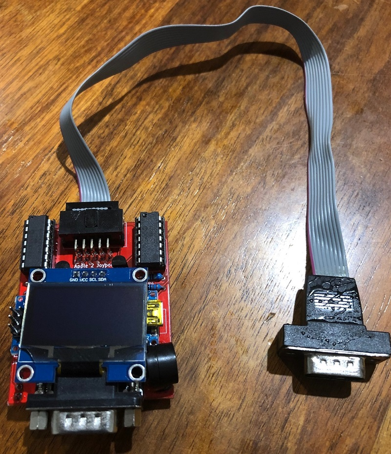
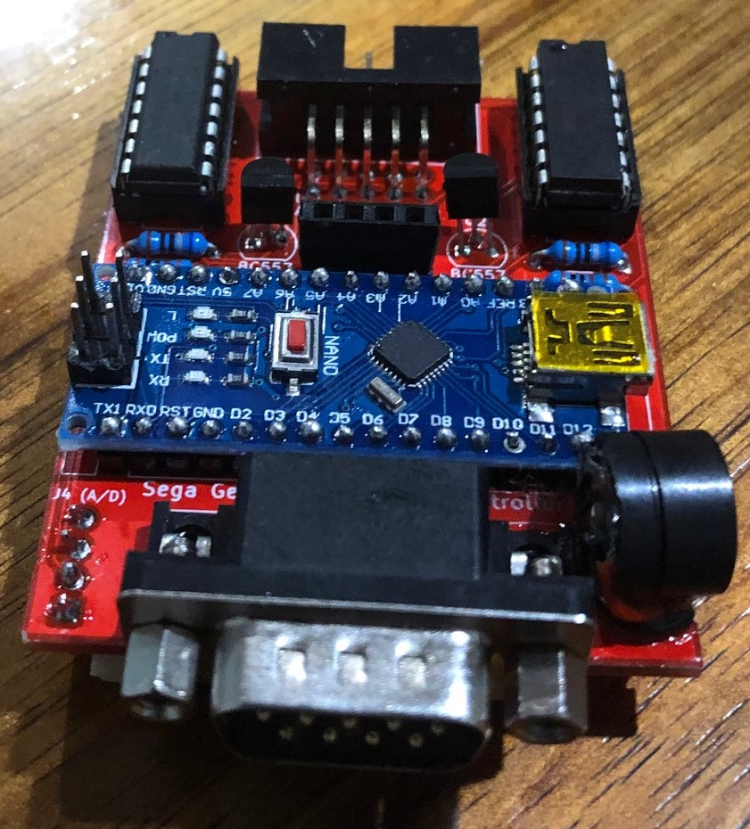
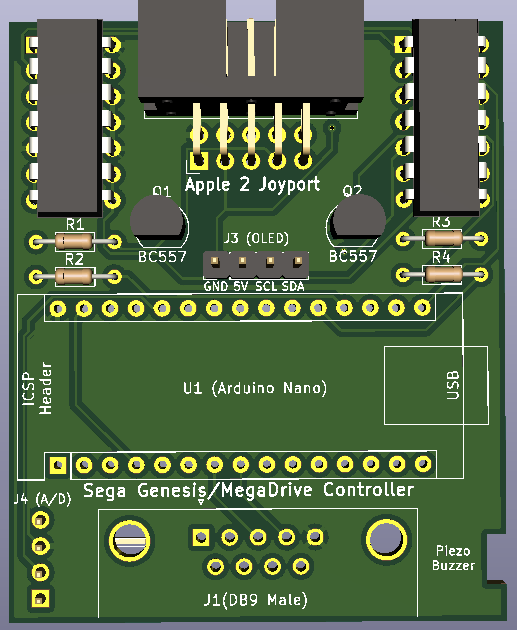
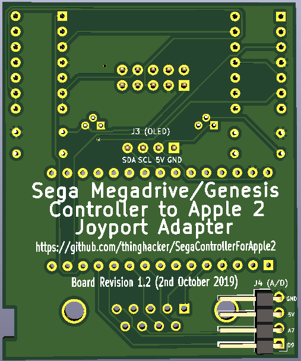
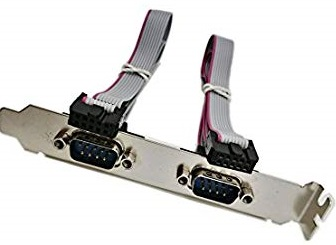
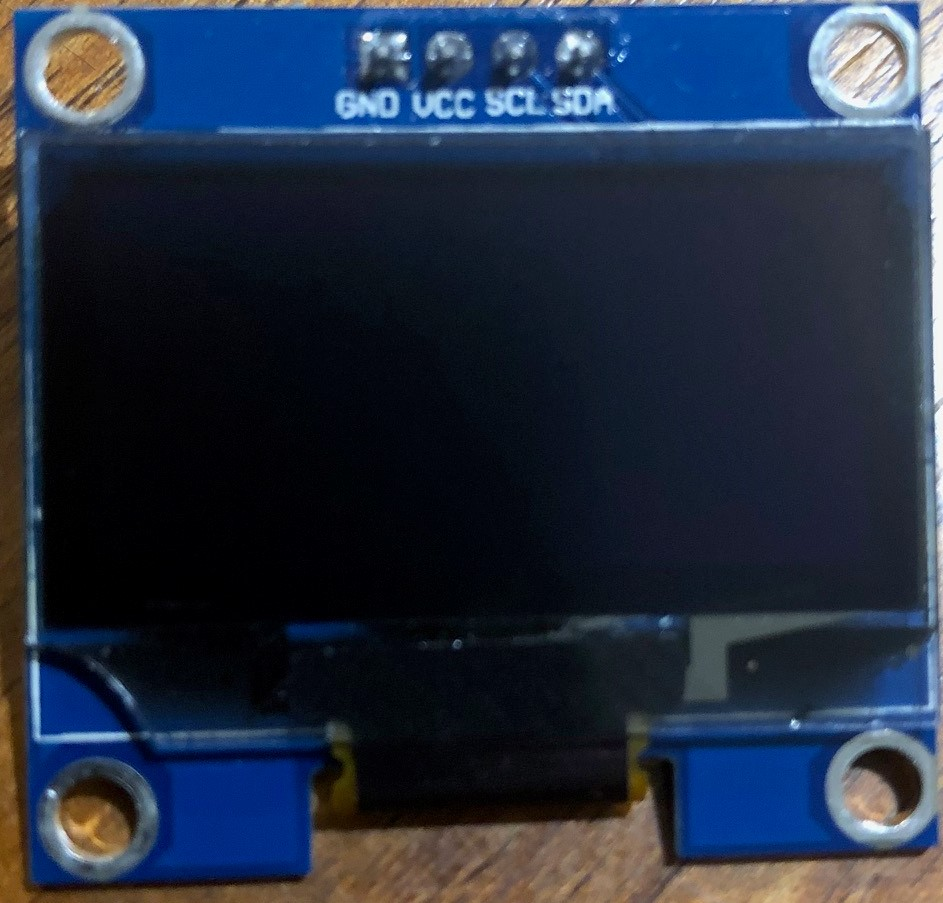
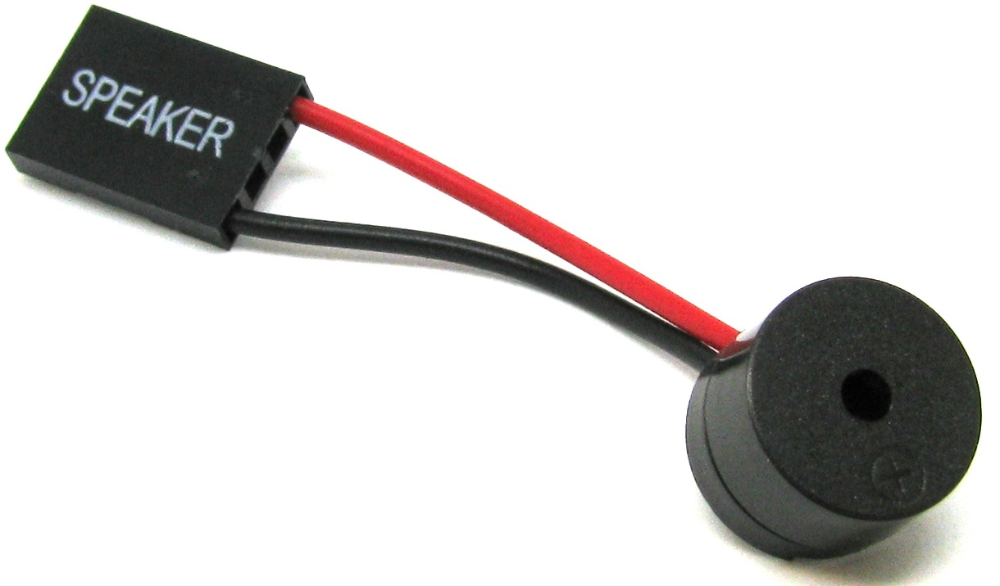

# SegaControllerForApple2

## PCB
This is a two layer through hole design.  It was made using [Kicad](http://kicad-pcb.org/) with the associated PCB source in the projects [Kicad](kicad) directory.  Gerber files are in the projects [Gerber](gerber) directory

### Assembled PCB

Epoxy resin was applied in and around the DB9 connector of the Apple 2 Facing cable to reduce the possibility of breaking wires from the connector.

### PCB Without OLED but with Piezo Speaker

### PCB Top Layer

### PCB Bottom Layer

## Bill of Materials

|Designation              | Item    | Description |
| ------------ | ------------ |------------ |
| U1 | Ardunio Nano v3 | Controller for the system | 
| U2 | Microchip MCP42100 |Dual 100K SPI controlled Pot|
| U3 | Microchip MCP42100 |Dual 100K SPI controlled Pot|
| R1 | 680 Ohm Resistor | Resistor |
| R2 | 1K Ohm Resistor | Resistor |
| R3 | 680 Ohm Resistor | Resistor |
| R4 | 1K Ohm Resistor | Resistor |
| Q1 | BC557 Transistor| PNP Transistor |
| Q2 | BC557 Transistor| PNP Transistor |
| J1 | DB9 Male Right Angle PCB Mount Socket | Connects to Sega Gamepad |
| J2 | IDC-10 Right Angle PCB Mount Connector | Apple 2 Gameport Cable Connector |
| J3 | 4x1 Row Connector (Socket)| OLED Display Connector |
| J4 | 4x1 Row Right Angle Connector (Pins)| A/D Breakout (Usually connecting to a Piezo Buzzer) |
| C1 | PC IDC-10 to DB9 Serial Breakout Cable (usually found as two connected to a computer card edge connector | Connects from PCB to Apple 2 Gameport |
| O1 | SH1106 1.3" OLED (Optional) | PCB Display |
| P1 | PC Speaker - Piezo Buzzer (Optional) | PCB Display |

### C1 - Typically Sourced on Card Edge Connector (Only 1 cable required)

### O1 - SH1106 1.3" OLED

### P1 - PC Speaker - Piezo Buzzer

## Construction Notes
This PCB does not require advanced soldering skills and can be assembled relatively quickly, however it may be best to work with an experienced friend or watch some youtube videos on build techniques if you are uncomfortable with soldering.