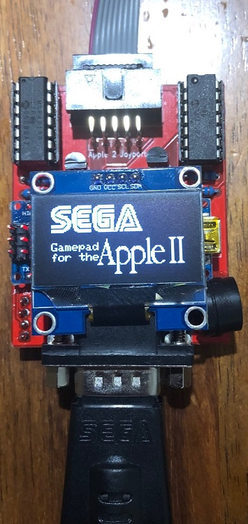
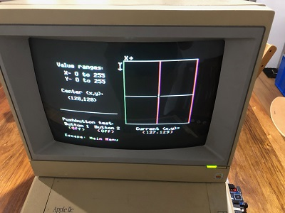

# SegaControllerForApple2


Use a Sega Genesis/Megadrive Gamepad with your Apple 2 Computer

This repo contains the PCB details and Arduino code to be able to connect a 3 or 6 button Sega Genesis or Megadrive Gamepad to an Apple 2 Computer which utilises and Arduino Nano v3 and uses Sega Controller code by [Jon Thysell](https://github.com/jonthysell/SegaController) 

[PCB Details including Bill of Materials](pcb)

[Arduino Source Code](source)

## Theory of Operation
Apple 2 computers use two RC timer circuits to determine the position of each joystick axis. The capacitors are within the Apple 2 itself, while the resistors are variable potentiometers within the joystick.  Apple 2 computers expect the joystick to have two 150KOhm pots for X (0 = Left, 150K = Right) and Y (0 = Up, 150K = Down)

This board uses two daisy-chained MCP42100s as a means to create a 200K pot for X and Y (software limit this to 150K +/- any calibration offsets).  As this is an analog circuit, characteristics of the circuitry probably has been changed since the Apple 2 came from the factory, meaning that it is generally necessary to include an offset to wanted values for proper centering (similar to the trimmer capability on original Apple analog sticks) 

The Arduino reads the Sega Gamepad and sets the pot values to simulate analog behavior depending on the emulated joystick mode and previous states (there is a digital mode two analog styles and a hybrid mode which are selectable by clicking the Sega Controller Start Button)

Transistors are uses as switches by the arduino to trigger firebutton 0 and 1 (the method used is based on the [diagram](http://apple2.org.za/gswv/a2zine/faqs/R030PCA2RF.GIF) which was originally posted at in the official Csa2 (comp.sys.apple2) Usenet newsgroup Apple II FAQs)

If installed, the OLED provides visual feedback into the joystick operational mode and indication as to the joystick fire button and analog pot positions.

Audible feedback is also provided through the Piezo Buzzer which can be helpful when executing changes in the middle of a game.

### Gamepad Button Functions

|Button              | Game Pad Mode  | When C is Held Down |
| ------------ | ------------ |------------ |
| A | Firebutton 0 | Firebutton 0 Auto Fire Toggle | 
| B | Firebutton 1 | Firebutton 1 Auto Fire Toggle |
| C | Return Joystick Axes to Centre | |
| Start | Cycle Gamepad modes (Digital, Analog1, Analog2, Hybrid) | Enter Calibration Mode|
| X | Not Used |  |
| Y | Not Used |  |
| Z | Not Used |  |
| Mode | Not Used |  |

#### Notes:
Holding A/B/C together to swap Firebutton 0 and Firebutton 1

While Analog1, Analog2 and Hybrid do not re-centre when the Dpad buttons are released, pressing button C will recentre the stick.


## Calibration Mode

holding <strong>C</strong> and pressing <strong>Start</strong> on the controller will enable calibration mode.

Using the Dpad, the centre offset can be adjusted as necessary. Pressing <strong>Start</strong> will save the calibration offsets into the Arduino EEPROM and return to normal joystick mode

[ComputerInspector (MECC 1.0)](https://ftp.apple.asimov.net/images/disk_utils/diagnostics/ComputerInspector%20%28MECC%201.0%29.dsk) located on Asimov has a joystick test program which is useful to check joystick operation and to calibrate the joystick centre




If you are unable to download and install the image, the short Applesoft basic program below can be used to verify the board and code is working as expected and to support calibration efforts (when centred, the computer should be reporting X=128, Y=128)

###  Basic Joystick Test program from comp.sys.apple2 Apple II FAQ:
```
20 PRINT "X= "; PDL(0); TAB(15); "Y= ";PDL(1); TAB(30);
30 IF PEEK(49249)>127 THEN PRINT "  B0";
40 IF PEEK(49250)>127 THEN PRINT "  B1";
50 PRINT: GOTO 20
```